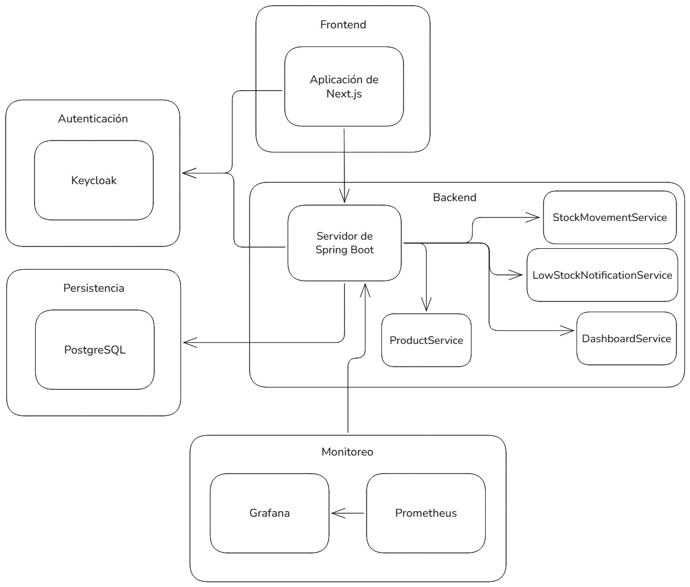

# Arquitectura del sistema



# Guía de instalación

Para instalar el proyecto se necesita un servidor con un entorno con Docker Compose y Git instalado. Posteriormente, seguir estos pasos:

1. Clonar repositorio
```sh
git clone https://github.com/leandro-0/ims.git ims
```
2. Configurar permisos de carpetas para los servicios de Keycloak y Grafana
```sh
mkdir -p ./keycloak/data && chmod -R 777 ./keycloak/data
mkdir -p ./grafana/data && chmod -R 777 ./grafana/data
mkdir -p ./grafana/dashboards && chmod -R 777 ./grafana/dashboards
```
3. Configurar variables de entorno en un archivo .env
```
<!-- Localización del Docker Compose y principales servicios -->
cd ims/backend

<!-- Crear .env -->
[...]
```
4. Subir el perfil de producción de Docker Compose para correr el sistema
```sh
docker compose --profile prod up -d
```

# APIs principales

## Productos
Estos endpoints están disponibles para la API de integración también.

- GET /api/v1/products/search
- GET /api/v1/products/{id}/details
- POST /api/v1/products
- PUT /api/v1/products/{id}
- DELETE /api/v1/products/{id}
- GET /api/v1/low-stock-notifications

## Movimientos de stock y dashboard

- GET /api/v1/stock-movements
- GET /api/v1/dashboard/stats
- GET /api/v1/dashboard/bellow-minimum-stock
