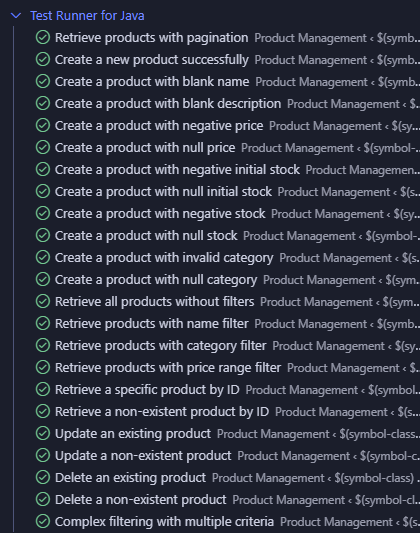

# Guía de pruebas

## Pruebas de aceptación basadas en Cucumber

Se implementaron múltiples escenarios de prueba con Cucumber con el objetivo de evualar el ciclo de CRUD de la entidad `Product`. A continuación se muestran los escenarios descritos en `product.feature`.

### Escenarios de recuperación de productos

#### Paginación

- Escenario: Retrieve products with pagination
- Entrada: 8 productos en base de datos, página 1, tamaño 5
- Resultado Esperado: 200 OK, 3 productos retornados, información de paginación correcta

#### Sin Filtros

- Escenario: Retrieve all products without filters
- Entrada: 3 productos en diferentes categorías
- Resultado Esperado: 200 OK, todos los productos retornados

#### Filtro por Nombre

- Escenario: Retrieve products with name filter
- Entrada: Búsqueda por "laptop"
- Resultado Esperado: 200 OK, solo productos que contengan "laptop"

#### Filtro por Categoría

- Escenario: Retrieve products with category filter
- Entrada: Filtro por categoría "CLOTHING"
- Resultado Esperado: 200 OK, solo productos de esa categoría

#### Filtro por Rango de Precio

- Escenario: Retrieve products with price range filter
- Entrada: Rango de precio 100-200
- Resultado Esperado: 200 OK, productos dentro del rango

#### Filtros Múltiples

- Escenario: Complex filtering with multiple criteria
- Entrada: Nombre, categoría, y rango de precio combinados
- Resultado Esperado: 200 OK, productos que cumplan todos los criterios

#### Obtener Producto por ID

- Escenario: Retrieve a specific product by ID
- Entrada: ID del producto
- Resultado Esperado: 200 OK, con los detalles del producto
- Prueba adicional: se probó que retornara 404 en caso de que el producto no exista

### Escenarios de operaciones protegidas por el rol Administrador

#### Crear Producto

- Exitoso: 201 Created con datos válidos
- Validaciones probadas: que retorne 400 Bad Request para:
  - Nombre en blanco
  - Descripción en blanco
  - Precio negativo o nulo
  - Stock inicial negativo o nulo
  - Stock negativo o nulo
  - Categoría inválida o nula

#### Actualizar Producto

- Existente: 200 OK con datos actualizados
- No Existente: 404 Not Found

#### Eliminar Producto

- Existente: 204 No Content indicando que fue eliminado correctamente
- No Existente: 404 Not Found

### Resultados

Todas las pruebas realizadas con Cucumber pasaron exitosamente, como se muestra en la siguiente imagen:

## Pruebas de Navegadores con Playwright

Proximamente...
